# ACCT: Automatic-Cell-Counting-with-TWS
A user friendly program for automated object counting using Trainable WEKA Segmentation.

## Table of Contents
1. [Installation Guide](#installation-guide)
2. [Prerequisites](#prerequisites)
3. [Software Dependencies](#software-dependencies)
4. [Manual Input Files](#manual-input-files)
5. [Creating Classifiers Using Weka](#Creating-Classifiers-Using-Weka)
6. [Creating Hand Count Markers](#creating-hand-count-markers)
7. [How to Use](#how-to-use) 
8. [Error Fixing](#error-fixing)

# Installation Guide
First you will have to download this program, which can be done through a terminal such as Git, Ubuntu, or Microsoft Powershell with the following line of code.
```
git clone https://github.com/tkataras/Automatic-Cell-counting-with-TWS.git
```
If you are not familiar with terminals, you can also click the green code button and select __Download ZIP__, then unzip the files in a desired location.

Next, ensure you have downloaded the software located in the [Prerequisites](#prerequisites) section.

Finally, you will have to manually copy and paste certain files into the __Plugins__ folder of your Fiji instalation of Imagej. 

Find where you downloaded Fiji in your file directory. Next, navigate to [scripts_for_auto_cell_count](scripts_for_auto_cell_count) then copy and paste the following files into your __Fiji.app/plugins__ directory. This is so you can run the program from ImageJ using the graphical user interface and macro menu.
```
ACCT_1.ijm
ACCT_2.ijm
ACCT_3.ijm
apply_BS_TWS_prob.bsh
apply_TWS_one_classifier_prob.bsh
```

# Prerequisites
-Current version of Fiji distribution of Imagej https://imagej.net/software/fiji/

-Python https://www.python.org/ftp/python/3.10.0/python-3.10.0-amd64.exe

-Currently the ImageScience package for Fiji must NOT be installed or have been installed on the Fiji installation in use since it is not compatable with our program. If you have installed ImageScience, you can uninstall and reinstall Fiji to solve the problem.

# Software Dependencies
__Windows:__ In order to install the neccessary Python packages, the Python Scripts folder must be added to the terminal's knowelege of working areas designated by the PATH file.

If you are unfamiliar with Python, the easiest way to do this is to do the following steps:

Locate the Python install directory through the Windows search in Explorer

Copy the address of the scripts folder from the location bar at the top of the explorer window

Access Edit system environment variables in the control panel, select Environment variables, select Path, Edit and new

Paste the copied python scrips location into the new path line

Open Windows Powershell from the search menu and the packages can be installed by copying the install commands line by line and right clicking on the working line of the termnial to paste.

__Linux/Mac:__ Open your terminal and copy paste the following into the command line.
```
sudo apt install python3-pip

pip3 install numpy
pip3 install scipy
pip3 install pandas
pip3 install python-time
pip3 install imageio
pip3 install sklearn
pip3 install matplotlib
```

# Manual Input Files
```
For consistency of input, all inut images should be in .PNG format
TODO should be able to handle .JPG and .tiff, just need to test it
```
Place the entire set of images you would like counted inside of [testing_area/images](testing_area/images).

Place the set of images you would like to use as images to train the classifiers inside of [training_area/training_images](training_area/training_images). This is mainly for you to keep track of what images you used for training.

Place the set of images you would like use for validation of the machine learning classifiers in [training_area/Validation_data](training_area/Validation_data).

These three sets should have no overlapping images for the most statstically valid automatic counts.

You will also need to create a .csv file storing the experimental condition data for your images. ACCT is set up to handle two condition comparisons automatically. Currently, this is neccessary even if you only have one condition. We refer to these files as genotype.csv for the validation data, and geno_full.csv for the experimental data.
```
genotype.csv 
```
Place this file inside of [training_area/](training_area/). 

The file will look similar to this with "geno" as a specified header and your conditions for each image of your training set in alphabetical order written in each row.

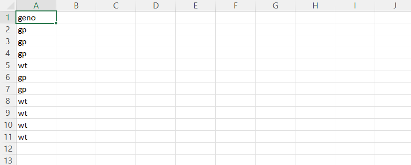

```
geno_full.csv
```
Place this file inside of [testing_area/](testing_area/). It will look similar to the other genotype file but will have rows for every image in your complete dataset with rows containing the condition/group of the image the row represents.
```
User generated classifiers through Trainable Weka Segmentation
```
Place these classifiers inside of [training_area/Classifiers/](training_area/Classifiers/). These should be __.model__ files.

Making classifiers is described in the [Creating Classifiers Using Weka](#Creating-Classifiers-Using-Weka) section.

## Image Protocols
Images should be of the same dimensions.

Images should be free of major artifacts (Optional but recommended).

Images should be in .png format.
TODO (Haven't tested yet) Images could also be .jpg or .tiff

Each image _must_ have a unique file name.

Image file names should not contain the following symbols as they are used for other purposes.
```
.     (except for the default symbol starting the file extension)
:
```
## Projected Images
In some cases, paired or grouped images should be projected to create a complete cell count of an area. We are working on a more flexible implimentation of ACCT for handling projected images, but presently the images should have the following identifying characteristics to know which projections associate with each other: 

The final characters denoting the end of unique image information should be: ___XY__

There are 3 loci for levels of identifying information seperated by __-__:

1. The __first__ space, before any __"-"__

2. The __second__ space, after a single __"-"__

3. The __last__ space, after all __"-"__, only the first two characters are considered

Example: __BKO-426-S42-Iba-Syn-Cortex-10x-F1a_XY1562195071_Z0_T0_C2.tiff8bit.pngcropped.pngNpt3__

In this example, the relevant sections are:
```
426
S42
F1
```

# Creating Classifiers Using Weka
ACCT uses Weka Classifiers to count images, which the user will initially need to create. 

Before starting, close any images open in Fiji.

Start by selecting all [training_area/training_images](training_area/training_images) in your file explorer progam and drag them to the Fiji user interface bar to open them all at once.

Once all images are open, use the Fiji search bar to apply the __Images to Stack__ operation.

With the image stack selected, launch the __Advanced Weka Segmentation__ plugin from the Fiji search bar, or __Plugins__ menu.

With the __full training image stack__ open in Weka, we can beging training classifiers.

It is best to start with small amounts of input data, using the free selection tool to highlight some cell pixels in an image and adding them to __Class 1__ and some non-cell pixels, adding them to __Class 2__.


After the first two bits of training data are added, press __Train classifier__ to begin building a classifier based on the provided data, which will then be applied to the whole image stack, visible from an overlay on all images. __The first training can take several minutes on an image stack, as features are calcuated for the first time for each image. This speed improves on the following training.__

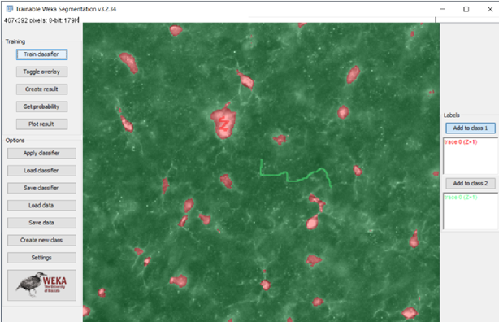

Once there is feedback on the current state of the classifier, save it with the __Save classifier__ button, before adding a few more pixels of training data based on areas with inaccurate segmentation based on the current classifier overlay. 

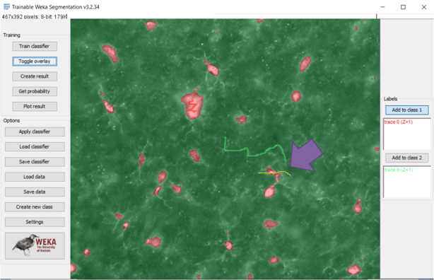

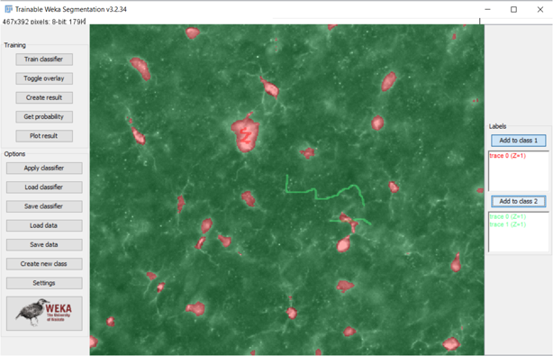

With the new training data added, press __Train classifier__ and observe the result, making further corrections and saving the intermediate classifiers.

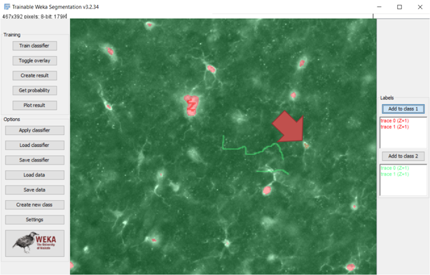

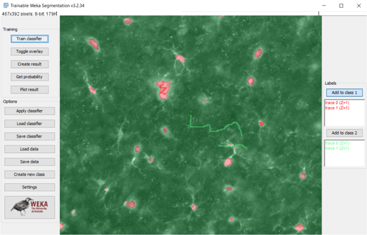

Each new addition of data will change the persepctive of the classifier based on the new data, and we can save multiple classifiers which allows us to select the most effective point in training based on the validation data.

For more information, there is a thorough and effective explanation of __Trainable Weka Segmentation__ plugin located at: https://imagej.net/plugins/tws/ .

ACCT will expect at least 2 classifiers to compare performance against for its validation step.

# Creating Hand Count Markers
Hand count markers are created in Imagej using the Point Selection Tool, available in the toolbar, and the ROI manager, which is under __Analyze >> Tools >> ROI Manager__. You can also type ROI Manager in the search bar and select it.

1. Open an image and place one or two count markers 
2. Add the selections to the ROI manager
3. Rename the new ROI with the image name (This is most easily done by using the following keyboard shortcuts: Ctrl+Shift+d -> Ctrl+c -> Ctrl+w -> right click the ROI and select Rename -> Ctrl+v -> Enter)
4. Continue selecting cell locations, peridocally updating via the Update button in the ROI Manager
5. When all cells are selected, save in the [training_area/Validation_Hand_Counts](training_area/Validation_Hand_Counts) folder, or the [testing_area/Audit_Hand_Counts](testing_area/Audit_Hand_Counts) folder for the audit image set.
6. Open a new image and repeat until all validation or audit images are counted.

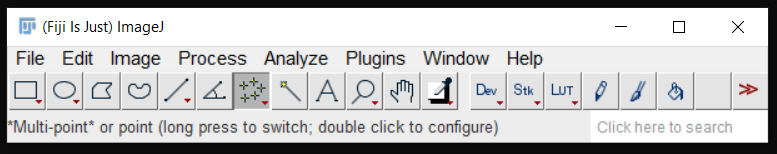

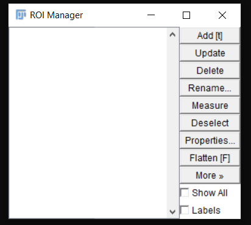

# How To Use

TODO: By downloading our Github repository you will have a set of folders for demo and for experimental use. (Don't have a demo with example data yet)

## Stage 1
From the ImageJ bar, navigate and select __Plugins >> ACCT 1__. You may need to scroll down for a period of time to find it.

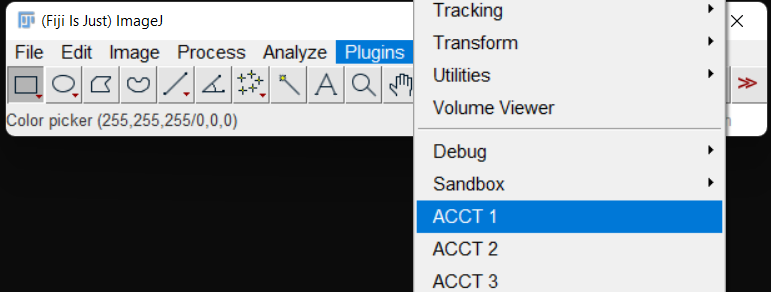

__1.1__ The first step is to initiate the pipeline. You will be prompted to locate the installation location of the pipeline, as this will vary by user preference. This is so that our program knows where you have downloaded it. Select the directory/folder named [scripts_for_auto_cell_count](scripts_for_auto_cell_count).

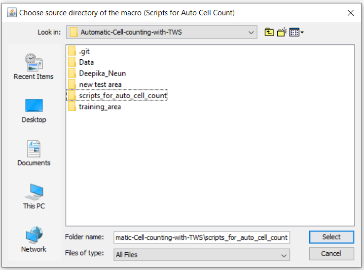

__1.2__ The pipeline will ask if you want to run Trainable Weka Segmentation. This will individually apply classifiers to the validation data and output the accuracy statistics using hand count placement .roi files and the supplied genotypes.csv file. This stage needs to only be run once for a set of validation images, but you may want to repeatedly run later stages, such as stage __1.4__, to optimize your results. Thus, we give the option to skip this stage. By default, it is set to run.


__1.3__ Our data includes paired images in individual fields of view for increased context when counting, so intermediate stage are included to identify and project these image pairs for the final automatic count. If your data does not include paired images, do not select this option below:

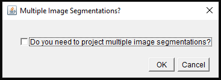

__1.4__ To count the number of objects in your data, the program defaults to a pixel minimum and maximum object size. These cuttoffs will have significant effects on accuracy and vary completely by application. You will be prompted to select these values. This has to be left to the user since the size of the objects they want counted will vary between different users.

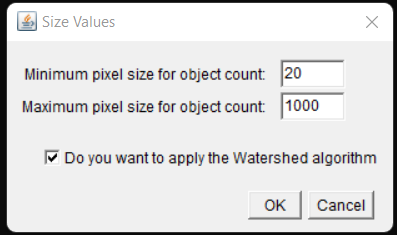

After the pipeline completes a run, run times will vary by hardware capacity, open the __All\_Classifier\_Comparison\_(current time).csv__ file to compare the performance of the various classifiers. This is a summary of the overall statistical performance of each classifier.

More statistical information will be printed to the log window.

This will be located under [training_area/Results](training_area/Results).

If you desire even more detailed statistical information about each individual classifier:
1. Reciever operator curves are also automatically generated for each classifier and located inside of __training_area/Weka_Output_Counted/classifier#/classifier#\_roc\_curve.pdf__.
2. The number of true positives, false positives, and false negatives for each individual image for each individual classifier can be found in __training_area/Weka_Output_Counted/classifier#/classifier#\_Final.csv__.
3. The morphological data and the correctness of each individual object counted for each individual image for each indivdual classifier can be found in __training_area/Weka_Output_Counted/classifier#/classifier#\_Results.csv__.

As an example, the output in log will look like this.

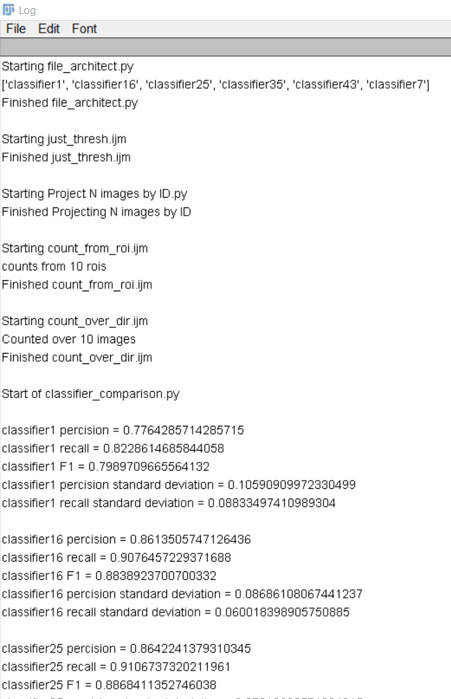

## Stage 2
From the ImageJ bar, navigate and select __Plugins >> ACCT 2__

__2.1__ Once again, the program must know where it is downloaded. Select the directory/folder named [scripts_for_auto_cell_count](scripts_for_auto_cell_count).

TODO: Maybe add links to each folder inside of this README?


__2.2__ Now, select the most accurate classifier (or any classifier of your choosing). Selecting the most "best" classifier is left to the user, but information is supplied in the form of accuracy values in Precision, Recall and F1 score, as well as statistical outputs of mean accuracy comparison between two separate experimental conditions entered in the genotypes.csv file. This program is set to handle any N number of conditions, performing Welch 2 sample T-Tests and ANOVA respective to the number of conditions in the genotype.csv file. 

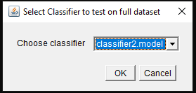

__2.3__ After the classifier is selected, the pipline applies the single selected classifier across the previously unseen dataset and produces count and basic morphology measurements, as well as a handful of prescribed statistical comparisons. This is similar to stage __1.2__. As in that step, the user will only need to run this once for a full dataset, but may want to repeatedly run later stages, such as stage __2.4__, to optimize your results. Thus, we give the option to skip this step. By default, it is set to run.


__2.4__ Repeat stage __1.3__ and __1.4__ with the exact same parameters you used in stage __1__. This stage requires a second genotypes file named __geno_full.csv__ from the user containing experimental grouping information for the unseen dataset. This serves the exact same purpose as __genotype.csv__, but for the full set of images.

If you desire even more detailed statistical information about the selected classifier:
1. The number of counted objects for each individual image for each individual classifier can be found in __testing_area/Weka_Output_Counted/classifier#/classifier#\_Final.csv__.
2. The morphological data of each individual object counted for each individual image for each indivdual classifier can be found in __testing_area/Weka_Output_Counted/classifier#/classifier#\_Results.csv__.

## Stage 3
*** 
Additionaly, the third step of the pipeline sets aside a random sample of images equal to the number of validation images and equally distributed between experimental groups to serve as the performance estimate on the unseen data. This performance analysis requires user input in the form of .roi hand counts, similar to what was done in the first step of the program. This audit dataset is then used to calculate the same statistics as the validation dataset for comparison.

__TODO__: Currently the program allows users to themselves chose images from the full dataset they want to use to audit the final result with. It isn't in the demo branch yet and the code to randomly select images is commented out as of now. So it's manual.

***

# Error Fixing
## Installation Errors
__I can't move the files listed in the installation guide into the Plugins folder__
1. It may be that you do not have permission to move files into that location. It may be your computer downloading Fiji into a protected location, like the iCloud. Try moving it, or downloading it again, to a local folder and try moving the folders again.
  
__I want to use other classifier models besides the ones that come with ACCT__
1. Weka allows installation of other classifier models which is explained at the following website: https://imagej.net/imagej-wiki-static/Trainable_Weka_Segmentation_-_How_to_install_new_classifiers

## Program Errors
__My program is giving me an index out of bounds exception.__
1. Keep subfolders in [training_area/](training_area) and [testing_area/](testing_area) free of files other than their intended content. Failing to do so may cause the program to give incorrect results.
2. When running the program again with a new set of images, classifiers, etc. you will want to remove all the folders generated by the program so that the file architecture is the same as it was when downloaded from Github. 
3. Make sure images have unique and corresponding file names to your ROI counts.

__If you get an error message stating "Error when adjusting data!",__
1. In our experience, this occurs mostly when the ImageJ updates its software. It is most often solved by uninstalling and reinstalling Fiji. You could also try the ImageJ updater, but it doesn't always work.
2. It could be that one of your classifier.model files got corrupted, and needs to be remade.

__My roi_counts.csv looks like it has repetitive data, or it looks like it is full of error messages__
1. Close all ImageJ windows except for the task bar. This can be from running ACCT and stopping the program midway through, then rerunning. It can also be from just rerunning the program. The issue is due to the Results and Summary windows remaining open, which get added to the csv file again when the program generates it.

__I have applied classifiers with BS TWS to many of the images but had to stop for some reason or for some error and I do not want to restart the long process again for the images I already finished.__
1. You can remove images that you have already processed in images to skip forward, but be sure you know that you processed these images correctly.

__No ROC plot appears in Weka_Output_Counted folders__
1. You may not have all python packages installed correctly. Make sure all python packages are installed and available.
