#

- - -

# ACCT: Automatic-Cell-Counting-with-TWS

A user friendly program for automated object counting using Trainable WEKA Segmentation.

- - -

<br>
<br>
<br>
If you use our tool, please cite [Kataras, T.J., Jang, T.J., Koury, J. et al. *ACCT is a fast and accessible automatic cell counting tool using machine learning for 2D image segmentation*. Sci Rep 13, 8213 (2023).](https://doi.org/10.1038/s41598-023-34943-w).

If you have questions or comments, feel free to contact [tjang006@ucr.edu](tjang006@ucr.edu). :D

## Table of Contents

1. [Installation Guide](#installation-guide)
2. [Prerequisites](#prerequisites)
3. [Software Dependencies](#software-dependencies)
4. [Manual Input Files](#manual-input-files)
5. [Creating Classifiers Using Weka](#creating-classifiers-using-weka)
6. [Hand Placed Markers for Validation](#creating-hand-placed-markers-for-validation)
7. [How to Use](#how-to-use)
8. [Demo](#demo)
9. [Errors and Troubleshooting](#errors-and-troubleshooting)

# Prerequisites

* Version v1.53c of the Fiji distribution of ImageJ: https://downloads.imagej.net/fiji/archive/20201104-1356/fiji-win64.zip

```
For non-Windows 64 bit installations for FIJI version 1.53c:
https://downloads.imagej.net/fiji/archive/20201104-1356/
```

* Python: https://www.python.org/ftp/python/3.10.0/python-3.10.0-amd64.exe

(If you are using an older version of Windows, such as Windows 7, you can find compatable versions of Python here: https://www.python.org/downloads/windows/)

**(Ensure the "add to path" checkbox is selected during installation.)**

* *Currently* the ImageScience package for Fiji must NOT be installed or have been installed on the Fiji installation in use since it is not compatable with our program. If you have installed ImageScience, you can uninstall and reinstall Fiji to solve the problem. Alternatively, it is possible to use ACCT from a fresh installation of Fiji.

# Installation Guide

First, you will have to download this program, which can be done through a terminal such as Git, Ubuntu, or Microsoft Powershell with the following line of code.

```
git clone --depth 1 https://github.com/tkataras/Automatic-Cell-counting-with-TWS.git
```

If you are not familiar with terminals, you can also click the green code button and select **Download ZIP**, then unzip the files in a desired location.

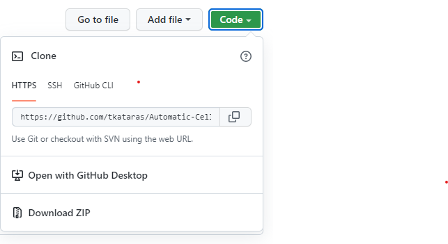

A version of the program with a small set of demonstration data can be found here:
https://github.com/tkataras/Automatic-Cell-Counting-with-TWS/tree/demo\_with\_data

Next, ensure you have downloaded the software located in the [Prerequisites](#prerequisites) section.

Finally, you will have to manually copy and paste certain files into the **Plugins** folder of your Fiji instalation of ImageJ.

Find where you downloaded Fiji in your file directory. Next, navigate to [scripts\_for\_auto\_cell\_count](scripts_for_auto_cell_count) then copy and paste the following files into your **Fiji.app/plugins** directory. This is so you can run the program from ImageJ using the graphical user interface and macro menu.

```
ACCT_1.ijm
ACCT_2.ijm
ACCT_3.ijm
apply_BS_TWS_prob.bsh
apply_TWS_one_classifier_prob.bsh
```

# Software Dependencies

**Windows:** In order to install the neccessary Python packages, the Python Scripts folder must be added to the terminal's knowledge of working areas designated by the PATH file. To do this, ensure the "add to path" checkbox is selected during the installation of Python.

If you have an existing installation of Python not added to path, perform the following steps to add Python to the path:

```
Locate the Python install directory through the Windows search in Explorer.
Copy the address of the scripts folder from the location bar at the top of the Explorer window.
Access Edit system environment variables in the control panel, select Environment variables, select Path, Edit and new.
Paste the copied Python scrips location into the new path line.
```

With Python added to the path, open Windows Powershell from the search menu and the packages can be installed by copying the following install commands line by line. Right click the working line of the termnial to paste the command.

```
pip3 install numpy
pip3 install scipy
pip3 install pandas
pip3 install python-time
pip3 install imageio
pip3 install sklearn
pip3 install matplotlib
```

**Linux/Mac:** Open your terminal and copy paste the following into the command line.

```
sudo apt install python3-pip

pip3 install numpy
pip3 install scipy
pip3 install pandas
pip3 install python-time
pip3 install imageio
pip3 install sklearn
pip3 install matplotlib
```

## File Architecture

This image represents the file architecture of ACCT, displaying information about the location and purpose of different folders. More details about individual sections of this image appear in the following sections.
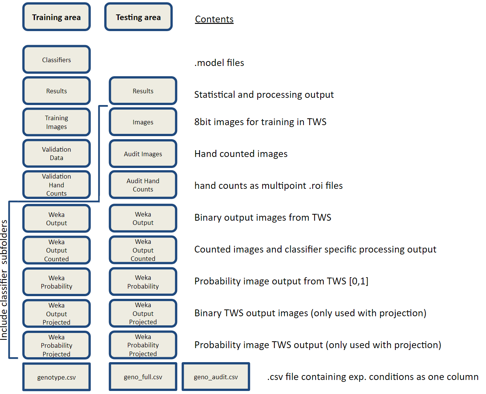

# Manual Input Files

```
All input images should be in .PNG, .JPEG, or .TIF format. 
Preferably, images should be in .PNG format.
```

Place the set of images you would like to use as images to train the classifiers inside of [training\_area/training\_images](training_area/training_images). This is mainly for you to keep track of what images you used for training.

Place the set of images you would like use for validation of the machine learning classifiers in [training\_area/Validation\_data](training_area/Validation_data).

Place the entire set of images you would like counted inside of [testing\_area/images](testing_area/images).

These three folders **should not** have overlapping images if you desire valid automatic counts.

You will also need to create a **.csv** file storing the experimental condition data for your images. ACCT is set up to handle two or more condition comparisons automatically. Currently, this is neccessary even if you only have one condition. We refer to these files as **genotype.csv** for the validation data, and **geno\_full.csv** for the full image dataset.

```
genotype.csv
```

Place this file inside of [training\_area/](training_area/).

The file will look similar to this with "geno" as a specified header and your conditions for each image written in each row. These conditions must be in the same order as your images in [training\_area/Validation\_data](training_area/Validation_data) which is in alphabetical order.


```
geno_full.csv
```

Place this file inside of [testing\_area/](testing_area/). It will look similar to the other genotype file but will have rows for every image in your complete dataset with rows containing the condition/group of the image the row represents.

```
User generated classifiers through Trainable Weka Segmentation
```

Place these classifiers inside of [training\_area/Classifiers/](training_area/Classifiers/). These should be **.model** files.

Making classifiers is described in the [Creating Classifiers Using Weka](#Creating-Classifiers-Using-Weka) section.

## Image Protocols

Images should be of the same dimensions.

Images should be 8-bit. Refer to [Creating Classifiers Using Weka](#Creating-Classifiers-Using-Weka) to make your images 8-bit.

Images should be free of major artifacts (Optional but recommended).

Each image *must* have a unique file name.

Image file names should not contain the following symbols or phrases as they are used for other purposes.

```
.     (Except for the default symbol separating the file extension from the file name.)
:
Mask of
```

## Projected Images

In some cases, paired or grouped images should be projected to create a complete cell count of an area. ACCT can handle projected images, but presently the images should have the following identifying characteristics to know which projections associate with each other:

The final characters denoting the end of unique image information should be: \_**XY**

There are 3 loci for levels of identifying information seperated by **-**:

1. The **first** space, after the first **"-"**
2. The **second** space, after the second **"-"**
3. The **last** space, after all **"-"**, and before \_**XY** . Only the first two characters are considered.

Example: **BKO-426-S42-Iba-Syn-Cortex-10x-F1a\_XY1562195071\_Z0\_T0\_C2.tiff8bit.pngcropped.pngNpt3**

In this example, the relevant sections are:

```
426
S42
F1
```

# Creating Classifiers Using Weka

ACCT uses classifiers, stored as **.model** files, to identify cells in images, which the user will need to create.

Before starting, close any images open in Fiji.

Start by selecting all [training\_area/training\_images](training_area/training_images) in your file explorer progam and drag them into the Fiji user interface bar to open them all at once.

Once all images are open, use the Fiji search bar to apply the **Images to Stack** operation. Select *OK*.

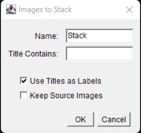

You will then want to convert the images to 8-bit for consistency, which will make the images appear in greyscale. To do this select **Image >> Type >> 8-bit**.

- - -

Optionally, you can instead convert an entire folder of images into 8-bit versions using macros in ImageJ. Note, this will require you to write a single line of code. From ImageJ, navagate to the tool bar and select **Process > Batch > Macro** which will open a window for you to select a folder to input images you want changed and the folder you want the output results to. This can be seen in the below example image.

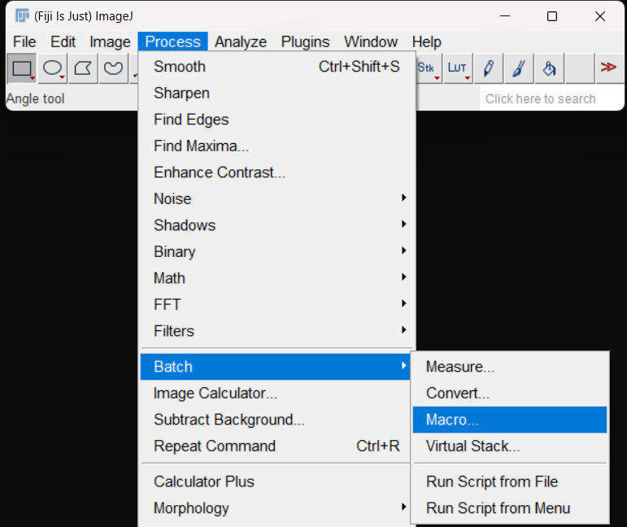

After this, ensure that the **Output format** is **TIFF**. Then add this exact line ```run("8-bit");``` to the large text box. You can select **Test** to see the output of a single image from the selected folder. Once you are ready, select **Process** and your images will be converted into 8-bit format and saved in the specified output folder. You should have your converted images saved in [training\_area/training\_images](training_area/training_images). An example of what this window looks like can be seen in the below example image.


- - -

Select the stack of images from [training\_area/training\_images](training_area/training_images), launch the **Advanced Weka Segmentation** plugin from the Fiji search bar, or **Plugins** menu.

With the **full training image stack** open in Weka, we can beging training classifiers.

It is best to start with small amounts of input data, using the free selection tool to highlight some cell pixels in an image and adding them to **Class 1** and some non-cell pixels, adding them to **Class 2**. After highlighting some pixels, select **Add to class 1** or **Add to class 2** to add these pixels to the class for cell pixels or non-cell pixels, respectively.


After the first two instances of training data are added, press **Train classifier** to begin building a classifier with the provided data, which will then be applied to the whole image stack, visible from an overlay on all images. You can select **Toggle Overlay** to remove or apply the overlay displaying what the classifier determined to be a cell or non-cell pixel. **The first training can take several minutes on an image stack, as features are calcuated for the first time for each image. This speed improves greatly in the following trainings.**


Once there is feedback on the current state of the classifier, save it with the **Save classifier** button, before adding a few more pixels of training data based on areas with inaccurate segmentation based on the current classifier overlay. Navigate to [training\_area/Classifiers](training_area/Classifiers) and save the classifier model with a name, such as **classifier1.model**.


With the new training data added, press **Train classifier** and observe the result, making further corrections and saving the intermediate classifiers. If your images have been converted to a stack, you can move the horizontal scroll bar to see other images that you can train on.


Each new addition of data will change the persepctive of the classifier based on the new data, and we can save multiple classifiers which allows us to select the most effective point in training based on the validation data during Stage **1**.

There will be an image overlay in red and green showing what the classifier thinks is part of the object and what is not. If you would like to see the original image under the overlay, select **Toggle overlay**.

To review, for ACCT's automatic counting to function **Cells** should be **RED**, or **class 1**, and **Background** should be **GREEN**, or **class 2**.

For more information, there is a thorough explanation of the **Trainable Weka Segmentation** plugin located at: https://imagej.net/plugins/tws/ .

ACCT will expect at least 2 classifiers to compare performance against for its validation step in Stage **1**.

## Changing Classifier Settings

**For users who are familiar with the basics.**

By default, the classifiers will be a Fast Random Forest model, however different models may give different results that the user may desire. Settings can also change what features of the image the classifiers will focus on in training, which may be important.

To change the settings, select **Settings**.

The default settings will look like the following image, with Fast Random Forest as the default model. The default features have selected checkboxes:

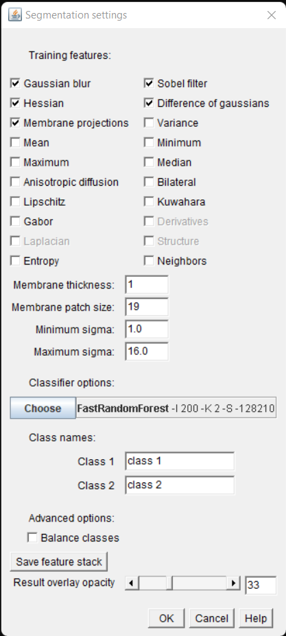

Selecting **Choose** will bring up a menu to select a different model. These models are organized by the general algorithm or approach they use to classify images.


You can edit the settings of the classifier here, which may allow you to create better classifiers than allowed by the default parameters.

More details about the meaning of these settings can be found here: https://imagej.net/imagej-wiki-static/Trainable\_Weka\_Segmentation.html#Training\_panel .

# Creating Hand Placed Markers for Validation

Hand count markers are created in ImageJ using the Point Selection Tool, available in the toolbar, and the ROI manager, which is under **Analyze >> Tools >> ROI Manager**. You can also type ROI Manager in the search bar and select it. You should also close **Trainable Weka Segmentation** if you still have it open.

1. Close **Trainable Weka Segmentation** if you still have it open.
2. Open the ROI manager through **Analyze >> Tools >> ROI Manager**.
3. From the toolbar, select the **Multipoint** option.
4. Navigate to [training\_area/Validation\_data](training_area/Validation_data).
5. Open an image and place several count markers.
6. Add the selections to the ROI manager.
7. Rename the new ROI with the image name (This is most easily done by using the following keyboard shortcuts: **Ctrl+Shift+d -> Ctrl+c -> Ctrl+w -> Left click the ROI >> Select Rename -> Ctrl+v -> Enter**).
8. Continue selecting cell locations, peridocally updating via the Update button in the ROI Manager.
9. When all cells are selected, save the .roi file in the [training\_area/Validation\_Hand\_Counts](training_area/Validation_Hand_Counts) folder if placing markers for the validation images, or in the [testing\_area/Audit\_Hand\_Counts](testing_area/Audit_Hand_Counts) folder for the audit image set during Stage **3**. To do this select **More >> Save** and navigate to the folder you wish to save the file in.
10. Once saved, select the roi in the ROI manager and select **Delete** before moving on to the next image. Then close the image so you can open the next image. Your computer will ask if you want to save changes you made to the image, but you *do not* want to save changes. Instead, select **Don't Save** when closing the image.
11. Open a new image and repeat until all validation or audit images are counted.


# How To Use

The following is a step-by-step walkthrough of ACCT in its three stages:

1. [Stage 1](#Stage-1)
2. [Stage 2](#Stage-2)
3. [Stage 3](#Stage-3)

## Stage 1

From the ImageJ bar, navigate and select **Plugins >> ACCT 1**. You may need to scroll down for a period of time to find it.


**1.1** The first step is to initiate the pipeline. You will be prompted to locate the installation location of the ACCT folders, as this will vary by user preference. Select the directory/folder named [scripts\_for\_auto\_cell\_count](scripts_for_auto_cell_count).


**1.2** The pipeline will ask if you want to reset your folders. Specifically it will ask if you want to reset your Weka\_\* folders. This is because you may want to run ACCT with new images and so you will need to remove old files or the program will try to use those old files. If you select the option to reset your files, it will then ask to confirm that choice. By default, this is turned off.

**THIS WILL DELETE ALL PROCESSED IMAGES IN THE WEKA\* folders. Your .roi, .csv, classifier.model, and images will be left alone.**

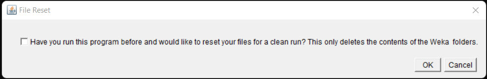
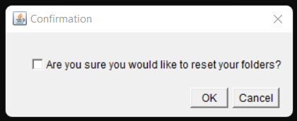

**1.3** The pipeline will ask if you want to run Trainable Weka Segmentation. This will individually apply classifiers to the validation data and output the accuracy statistics using hand count placement .roi files and the supplied genotypes.csv file. This stage needs to only be run *once* for a set of validation images at a specified threshold, but you may want to repeatedly run later stages, such as Stage **1.4**, to optimize your results. Thus, we give the option to skip this stage. By default, it is set to run. The default threshold is set to 0.5 but can be changed by the user.


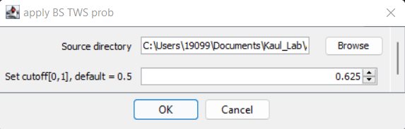

**1.4** Our data includes paired images in individual fields of view for increased context when counting, so intermediate stage are included to identify and project these image pairs for the final automatic count. If your data does not include paired images, do not select this option below:


**1.4.1** If you select this option, you will then be prompted to rerun the step that grouped the projected images into a combined image. This step takes a long time relative to other parts of the pipeline and only needs to be done once, so you are prompted to decide if you want to rerun this step.

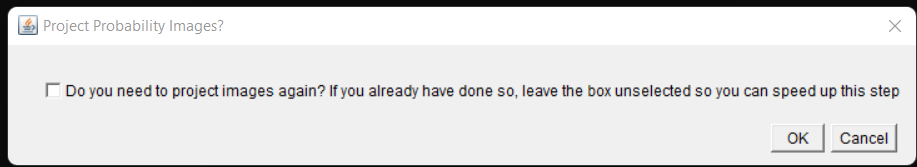

**1.4.2** Thresholding allows the user to select more or less stringent cuttoffs for pixels in an image to be considered -cell pixels. The default value of 0.5 represents a cuttoff probability of .5 where, based on the trained classifier, cell pixels are more likely to be cell than non-cell. Increasing the cuttoff will require more certainty for pixels to be identified as cell pixels, and lowering it will be more permissive. The default value of 0.5 is a good staring place, however, for most datasets.

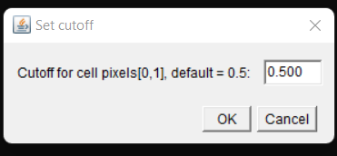

**1.5** To count the number of objects in your data, the program defaults to a pixel minimum and maximum object size. These cuttoffs will have significant effects on accuracy and vary completely by application. You will be prompted to select these values. This has to be left to the user since the size of the objects they want counted will vary between different users. You will also be prompted to optionally apply the watershed algorithm when counting images. This is used to separate objects that are touching or overlapping in the image so they can be separately counted. This is on by default.


After the pipeline completes a run, run times will vary by hardware capacity, open the **All\_Classifier\_Comparison\_(current time).csv** file to compare the performance of the various classifiers. This contains P-Value calculations for statistical significance as well. This is a summary of the overall statistical performance of each classifier.

More statistical information will be printed to the log window.

This will be located under [training\_area/Results](training_area/Results).

Note, to avoid division by 0 errors, images that are empty in the automatic count will be excluded from calculations for the overall precision, recall, F1 Score, and accuracy. This is mainly relavent if a classifier model does not select any object in the image as a cell. This needs a better explaination of the impact on the statistical outcome.

If you desire even more detailed statistical information about each individual classifier:

1. Reciever operator curves are also automatically generated for each classifier and located inside of **training\_area/Weka\_Output\_Counted/classifier#/classifier#\_roc\_curve.pdf**. (Note, Not all models classifiy pixels in a probabilistic manner, instead classifying by a binary label. Thus, useable ROC plots cannot be generated for that particular model.) Due to the implementation within ACCT, the inital threshold used in Step **1.3** will affect the predicted ROC curve, and will not predict values at thresholds lower than the starting threshold.
2. The number of true positives, false positives, and false negatives for each individual image for each individual classifier can be found in **training\_area/Weka\_Output\_Counted/classifier#/classifier#\_Final.csv**.
3. The morphological data and the correctness of each individual object counted for each individual image for each indivdual classifier can be found in **training\_area/Weka\_Output\_Counted/classifier#/classifier#\_Results.csv**.

As an example, the output in log will look similar to this.


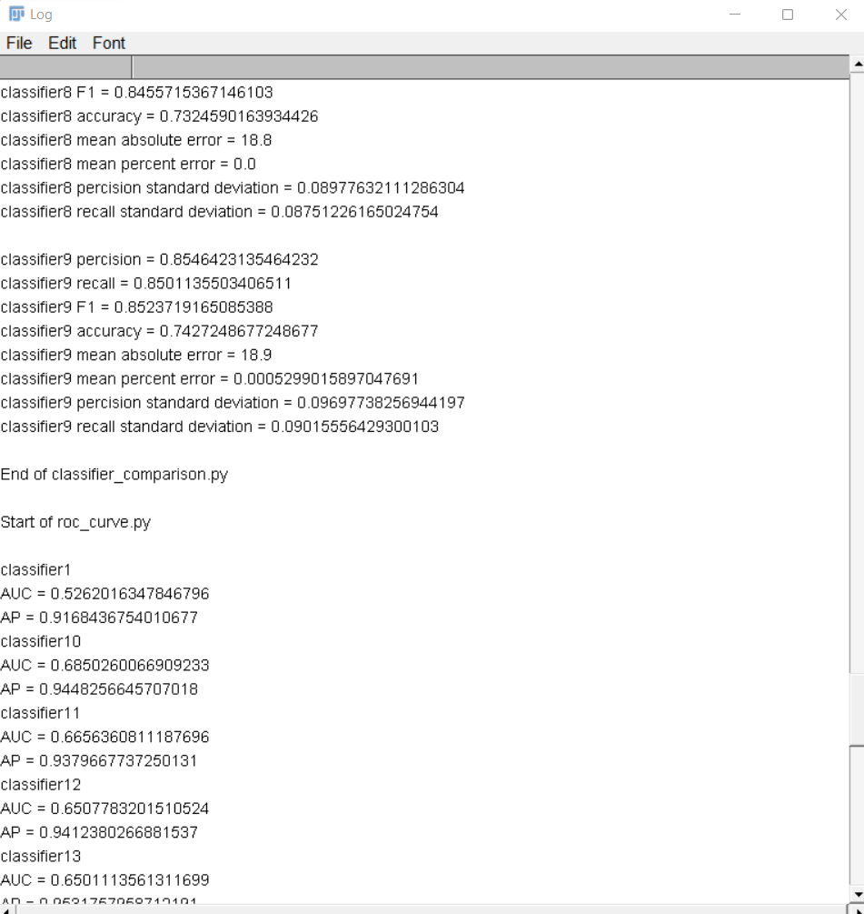

## Stage 2

From the ImageJ bar, navigate and select **Plugins >> ACCT 2**.

**2.1** Once again, the program must know where it is downloaded. Select the folder named [scripts\_for\_auto\_cell\_count](scripts_for_auto_cell_count).


**2.2** Select the most accurate classifier (or any classifier of your choosing). Selecting the best classifier is left to the user, but information is supplied in the form of accuracy values on the validation dataset in the form of in Precision, Recall and F1 score, as well as statistical outputs of mean accuracy comparison between two separate experimental conditions entered in the genotypes.csv file. This program is set to handle any N number of conditions, performing Welch 2 sample T-Tests and ANOVA respective to the number of conditions in the genotype.csv file.


**2.3** The pipeline will ask if you want to run Trainable Weka Segmentation. This will individually apply the selected classifier to the full image data set. This stage needs to only be run once for each classifier on the whole dataset, but you may want to repeatedly run later stages, to optimize your results. Thus, we give the option to skip this stage. By default, it is set to run.


You will explicitly need to select the .model file of the classifier you wish to run. You also can set the threshold value in this step.

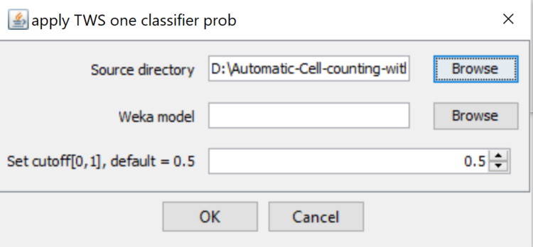

**2.4** Our data includes paired images in individual fields of view for increased context when counting, so intermediate stage are included to identify and project these image pairs for the final automatic count. If your data does not include paired images, do not select this option below:


**2.4.1** If you select this option, you will then be prompted to rerun the step that grouped the projected images into a combined image. This step takes a long time relative to other parts of the pipeline and only needs to be done once, so you are prompted to decide if you want to rerun this step.


**2.4.2** As described in section **1.4.2** Thresholding changes the permissiveness of the classifier, but it is best to start with the default value of 0.5.


**2.5** After the classifier is selected, the pipline applies the single selected classifier across the previously unseen dataset and produces count and basic morphology measurements, as well as a handful of prescribed statistical comparisons based on the genotypes file. This is identical to tage **1.5**.

Please use the same parameters you used in Stage **1** to ensure proper experimental design.


If you desire even more detailed statistical information about the selected classifier:

1. The number of counted objects for each individual image for each individual classifier can be found in **testing\_area/Weka\_Output\_Counted/classifier#/classifier#\_Final.csv**.
2. The morphological data of each individual object counted for each individual image for each indivdual classifier can be found in **testing\_area/Weka\_Output\_Counted/classifier#/classifier#\_Results.csv**.

As an example, the output in log will look similar to this.

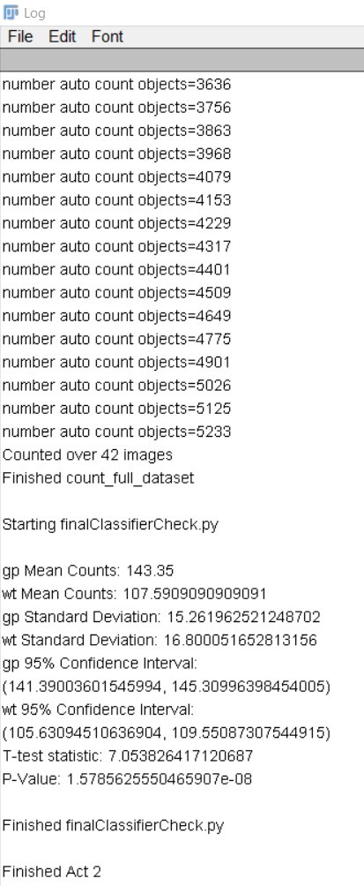
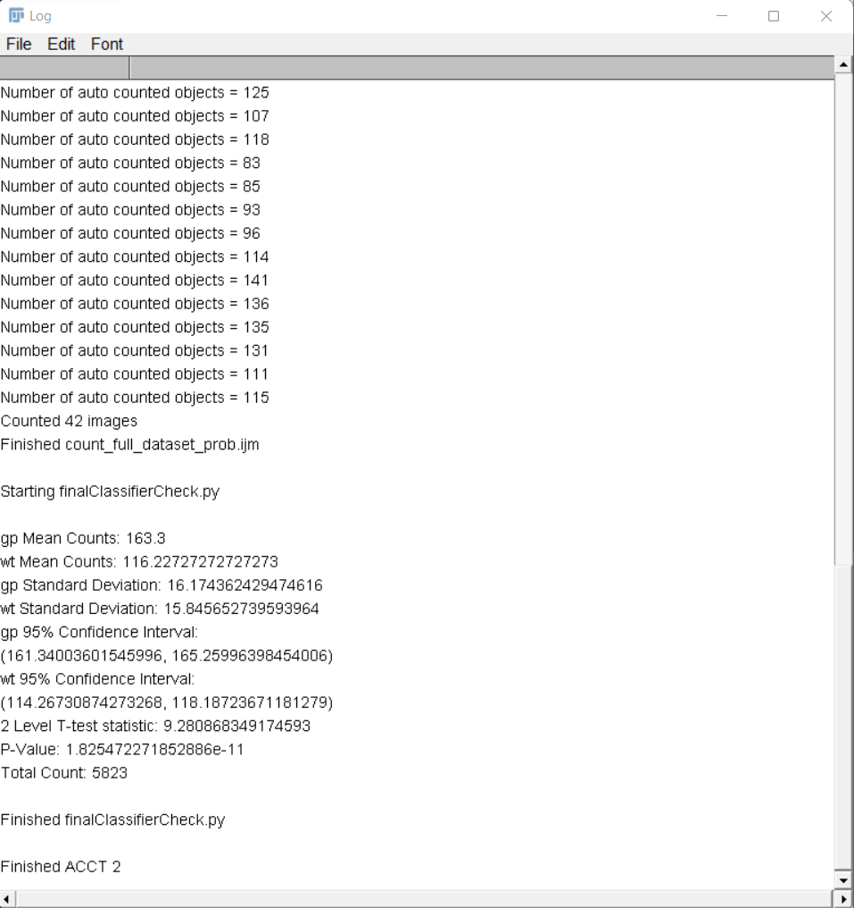

## Stage 3

- - -

The third step of the pipeline allows the user to audit the accuracy of a set of binary images using a set of hand placed markers. In this step, set aside a random sample of images equal to the number of validation images and equally distributed between experimental groups from the unseen data to serve as the performance estimate. This performance analysis requires user input in the form of .roi hand counts, similar to what was done for the validation images in ACCT 1. This audit dataset is then used to calculate the same statistics as the validation dataset for comparison. ACCT 3 can also be used to assess the accuracy of any set of binary images with multi point ROI markers.

**3.1** Once again, the program must know where it is downloaded. Select the directory/folder named [scripts\_for\_auto\_cell\_count](scripts_for_auto_cell_count).


**3.2** You will select which classifier you want to audit the performance of from the full dataset.

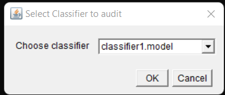

**3.3** The program will ask if you are ready to audit your images. This is because the program is waiting for you to do three steps:

1. Select the images from [testing\_area/images](testing_area/images) that you want to audit and move them into the [testing\_area/Audit\_Images](testing_area/Audit_Images) folder.
2. Generate equivalent .roi files for these images to be placed in the [testing\_area/Audit\_Hand\_Counts](testing_area/Audit_Hand_Counts) folder. This is done as in [Hand Placed Markers for Validation](#creating-Hand-Placed-Markers-for-Validation)
3. From [testing\_area/Weka\_Output\_Counted](testing_area/Weka_Output_Counted), move the matching images from the selected classifier you want to audit into [testing\_area/Audit\_Counted](testing_area/Audit_Counted)

Once this is done you can select **OK** with the checkbox selected.


**3.4** Same as **1.5** to set the maximum and minimum object size and toggle the watershed algorithm option.

Please use the same parameters you used in Stage **1** and Stage **2** to ensure proper experimental design.


As an example, the output in log will look similar to this.

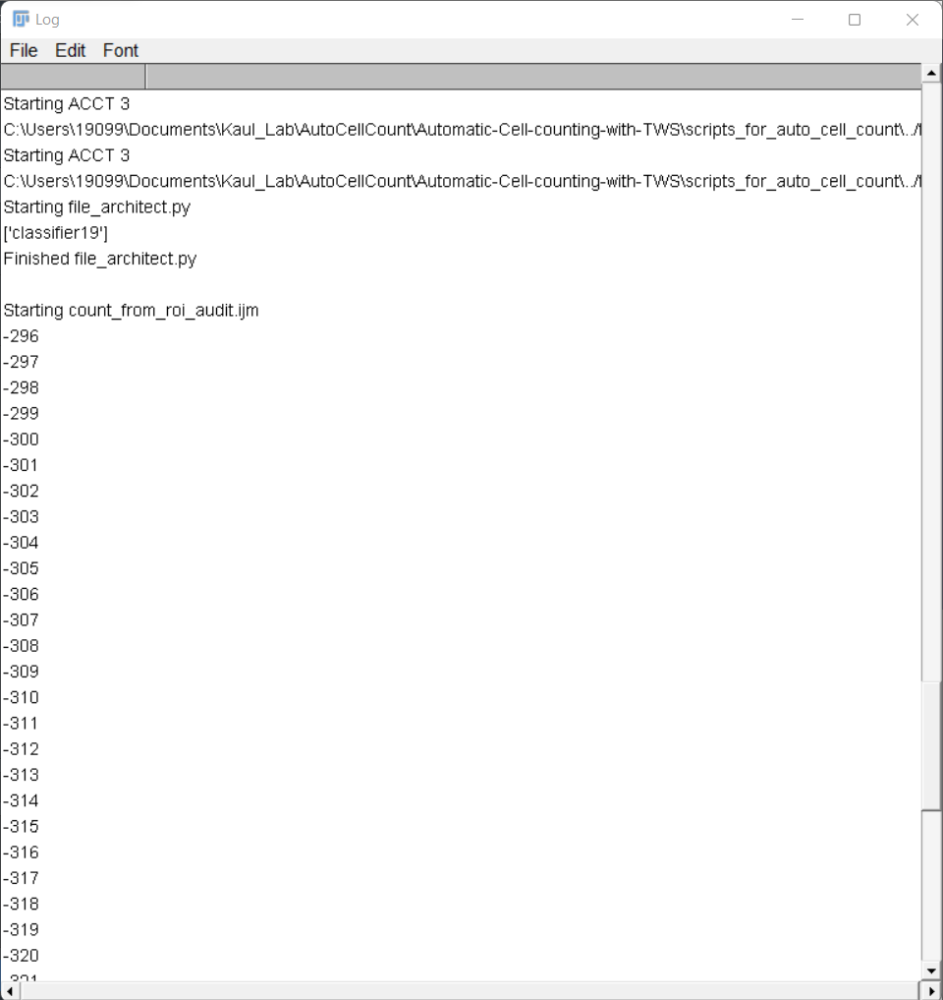
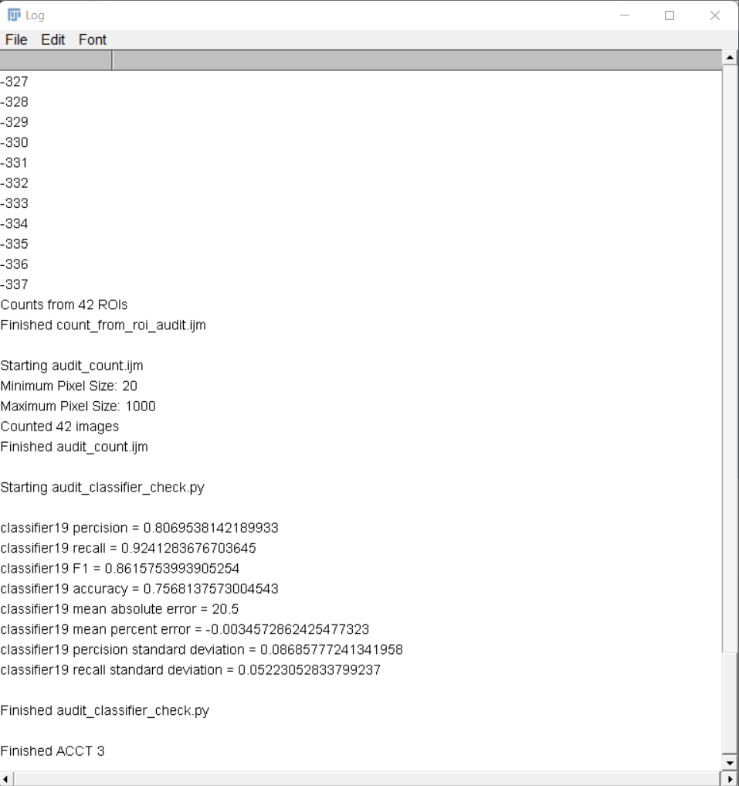

# Demo

A demo of the project can be found on the github branch **demo\_with\_data** which can be accessed by selecting the branch selection button, with the word "main". Once in this branch, select **Download Zip** as done in the [Installation Guide](#installation-guide).

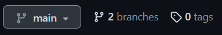

This demo contains a small set of images and hand count .roi files. To start, the only files needed from the user are classifier files which is done as stated in [Creating Classifiers Using Weka](#Creating-Classifiers-Using-Weka). The instructions in [How to Use](#how-to-use) remain the same for this demo of the project.

# Errors and Troubleshooting

## Installation Errors

**I can't move the files listed in the installation guide into the Plugins folder**

1. It may be that you do not have permission to move files into that location. It may be your computer downloading Fiji into a protected location, like the iCloud. Try moving it, or downloading it again, to a local folder and try moving the folders again.

**I want to use other classifier models besides the ones that come with ACCT**

1. Weka allows installation of other classifier models which is explained at the following website: https://imagej.net/imagej-wiki-static/Trainable\_Weka\_Segmentation\_-\_How\_to\_install\_new\_classifiers

**When converting my images to stack and then into 8-bit images, my program crashes**

1. This may happen if you are trying to stack and convert too many images at the same time. Instead, convert smaller sets of images into 8-bit instead of all at the same time.

## Program Errors

**ACCT will not run if I try to use the result from the search bar.**

1. If this is happening, instead of searching for ACCT in the search bar, select ACCT from the plugins menu

**My program is giving me an index out of bounds exception.**

1. Keep subfolders in [training\_area/](training_area) and [testing\_area/](testing_area) free of files other than their intended content. Failing to do so may cause the program to give incorrect results.
2. When running the program again with a new set of images, classifiers, etc. you will want to remove all the folders generated by the program so that the file architecture is the same as it was when downloaded from Github.
3. Make sure images have unique and corresponding file names to your ROI counts.

**If you get an error message stating "Error when adjusting data!"**

1. In our experience, this occurs mostly when the ImageJ updates its software. It is most often solved by uninstalling and reinstalling Fiji. You could also try the ImageJ updater, but it doesn't always work.
2. It could be that one of your classifier.model files got corrupted, and needs to be remade.

**If you get an error message stating it could not apply classifier:**

1. It could be that you forgot to train your classifiers on 8-bit images, which should look grey. When making classifiers, they need to be trained on 8-bit images and not 32-bit or color images which will create classifiers designed for those image types. The solution is to convert your images to 8-bit which can be done through the ImageJ bar by selecting **Image >> Type >> 8-bit**.
2. Alternatively, you can instead follow the optional directions listed in [Creating Classifiers Using Weka](#Creating-Classifiers-Using-Weka) which allows you to convert an entire folder of images into 8-bit at one time.

**My roi\_counts.csv looks like it has repetitive data, or it looks like it is full of error messages**

1. Close all ImageJ windows except for the task bar. This can be from running ACCT and stopping the program midway through, then rerunning. It can also be from just rerunning the program. The issue is due to the Results and Summary windows remaining open, which get added to the csv file again when the program generates it.

**I have applied classifiers with BS TWS to many of the images but had to stop for some reason or for some error and I do not want to restart the long process again for the images I already finished.**

1. You can remove images that you have already processed in images to skip forward, but be sure you know that you processed these images correctly.

**No ROC plot appears in Weka\_Output\_Counted folders**

1. You may not have all Python packages installed correctly. Make sure all Python packages are installed and available.
2. Check that the output to log says that the ROC curve was not generated due to the data being entirely false positives or true positives. This happens on occasion when a classifier is too restrictive or not restrictive enough. The program will not generate a ROC curve that is essentially a flat line in that situation.
3. Not all models classifiy pixels in a probabilistic manner, instead classifying by a binary label. Thus, ROC plots cannot be generated for that particular model.

**No Audit\_example.csv file appears in Results folder when running ACCT 3**

1. Make sure for ACCT 3 that images in **Audit\_Counted** match .roi files in **Audit\_Hand\_Counts** and the rows in **geno\_audit.csv**

**My output log says that "Counted 0 images" or "Counts from 0 ROIs"**

1. This is primarily due to having extra folders or files in **Weka\_Output\_Counted** or another Weka folder without a matching classifer.model file. The program will give this warning and will not give .csv file results in this case. This is due to the program searching for the matching classifier to the file and not finding one, then proceding to exit that script in the workflow.

**Java exception on Weka output file during ACCT at "Finished classification..." in log**

1. Run ACCT from the Plugins menu dropdown list or by selecting ACCT 1 via the search bar and select **Source** to open the script in the Imagej macro window and select **Run** on the source window.
2. If this does not solve the issue, run **apply\_BS\_TWS\_prob** by opening the file in Fiji from the **scripts\_for\_auto\_cell\_count** folder and then rerun ACCT and uncheck the box in the **Do you need to run Weka?** dialogue box when it appears.